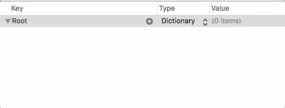

!!! info "Ejercicio"
    Al final de esta sección hay un ejercicio puntuado con **0.5 puntos** del total de **1.5 puntos** de todos los ejercicios de hoy.


Las *property list* son estructuras de datos tipo pares de clave-valor ampliamente utilizadas en iOS para almacenar datos de configuración. 

Las *property list* tienen dos limitaciones prácticas fundamentales:

- No se puede almacenar cualquier tipo de datos, solo algunos: `String`, valores numéricos, `Data`, `Date` o `Boolean`. Y como colecciones de datos `Array` y `Dictionary`.
- No son modificables, es decir, no tenemos un API para cambiar un único dato en el archivo. Hay que serializar de nuevo toda la estructura y generar el archivo partiendo de cero. Por ello no son adecuadas para almacenar grandes cantidades de datos.

## El formato de las *property lists*

Las *property lists* se pueden almacenar en archivos en modo texto o binario. En los ejemplos usaremos sobre todo el modo texto. En este modo se usa el formato XML, aquí tenemos un ejemplo:

```xml
<?xml version="1.0" encoding="UTF-8"?>
<!DOCTYPE plist PUBLIC "-//Apple//DTD PLIST 1.0//EN" "http://www.apple.com/DTDs/PropertyList-1.0.dtd">
<plist version="1.0">
<dict>
    <key>colorFondo</key>
    <array>
        <integer>255</integer>
        <integer>255</integer>
        <integer>0</integer>
    </array>
    <key>fuente</key>
    <string>System</string>
</dict>
</plist>
```

La *raíz* de la estructura de datos puede ser un diccionario, como en nuestro caso, o un array.

Xcode incluye un editor de *property lists* con el que podemos editar los datos de forma "asistida" sin tener que tocar directamente el XML. Creamos una nueva lista con `File > New ` y entre las plantillas elegimos evidentemente `Property list`. La extensión típica para estos archivos es `.plist`. Lo primero que hacemos es elegir qué va a ser la *raíz* (array o diccionario) y luego vamos creando "nodos". Para cada uno tecleamos un nombre, elegimos el tipo y tecleamos el valor.



En el caso de los arrays añadimos valores "desplegando" el nodo (con la flechita que aparece a la izquierda, y pulsando sobre el botón del `+`)


> Podemos también editar el XML en modo texto pulsando con botón derecho sobre el archivo y eligiendo en el menú contextual "Open as > Source Code"

## Leer una property list

Leer una *property list* de un archivo es muy sencillo usando el *encoding/decoding* de Swift. En el *framework* Foundation se define un `PropertyListDecoder` que sirve para deserializar estos archivos.

Por ejemplo supongamos una `plist` cuya raíz es un diccionario y con dos propiedades, `nombre` de tipo `String` y `puntuacion` de tipo entero. Una vez deserializados, podemos almacenar los datos en un `struct` de Swift como este

```swift
struct Props : Codable {
    var nombre : String
    var puntuacion : Int
}
```

Cuando se crea una `plist` con Xcode se añade al *bundle* de la aplicación. Suponiendo que está en dicho *bundle* podríamos leerla con el siguiente código, que como se ve es muy sencillo gracias a `Codable`:

```swift
if let plistURL = Bundle.main.url(forResource:"mi_plist", 
                                  withExtension:"plist") {
   let data = try Data(contentsOf: plistURL)
   let decoder = PropertyListDecoder()
   let misProps = try decoder.decode(Props.self, from: data)
   print(misProps)
}
```

> En versiones anteriores de Swift la forma de leer/guardar *property list* era distinta, algo más engorrosa (aunque tampoco excesivamente complicada). Podéis consultar un ejemplo comparando el método antiguo y el nuevo [en este blog](https://useyourloaf.com/blog/using-swift-codable-with-property-lists/).

## Guardar una *property list*

Veamos cómo haríamos el paso inverso: almacenar en un archivo una estructura de datos compatible con una *property list*. 

> Recordemos que el *bundle* de la aplicación es solo de lectura, por lo que un .plist almacenado en esta localización no será modificable. Si necesitáramos modificar el .plist del *bundle* la estrategia habitual es que cuando arranque la aplicación se realice una copia en otro directorio con permisos de escritura, típicamente `Documents`, y que a partir de entonces se trabaje con esa copia.

Suponiendo que tenemos definido el mismo `struct Props` del ejemplo anterior, haríamos uso de un `PropertyListEncoder` como sigue:

```swift
var urlDocs = FileManager.default.urls(for:.documentDirectory,
                                       in:.userDomainMask)[0]
let urlPlist = urlDocs.appendingPathComponent("result.plist")
let encoder = PropertyListEncoder()
encoder.outputFormat = .xml
let misProps = Props(nombre:"John", puntuacion:100)
let data = try encoder.encode(misProps)
try data.write(to: urlPlist)
```

## Ejercicio de la sección (0.5 puntos)

Tomando como base los ejemplos de código de la sección, define una estructura de datos propia y guárdala en un fichero .plist. Luego con la aplicación SimSim comprueba que se ha guardado correctamente. Paso a paso:

1. Crea un `struct` Swift llamado `Alumno` que sea conforme al protocolo `Codable` y que tenga dos campos:
   - un String llamado `nombre`
   - un array de `Float` con las `notas`
2. Crea dos alumnos y añádelos a un array
```swift
let a1 = Alumno(nombre: "Pepe", notas: [5, 8.5, 10])
let a2 = Alumno(nombre: "Eva", notas: [10, 9])
let alumnos = [a1,a2]
```
3. Basándote en el último ejemplo de código de esta sección, haz que se guarde el array `alumnos` en un fichero de tipo `.plist` llamado `alumnos.plist`. Puedes incluir el código en el `viewDidLoad` del `ViewController` para que se ejecute al cargar el *controller* de la *app*.
4. Comprueba mediante la aplicación SimSim que se ha creado el archivo dentro del `Documents` del *sandbox* de la *app*. Abre el archivo con algún editor de texto y comprueba su contenido. Incluye el archivo en las respuestas de los ejercicios.

