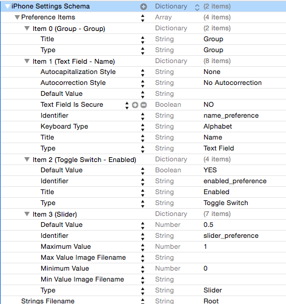
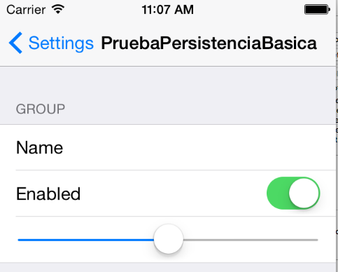

!!! info "Ejercicio"
    Al final de esta sección hay un ejercicio puntuado con **0.75 puntos** del total de **1.5 puntos** de todos los ejercicios de hoy.


## Preferencias de usuario

En la mayoría de las aplicaciones podemos configurar una serie de parámetros que las adaptan a las preferencias o necesidades del usuario. Son elementos tales como colores, tipos de fuentes, unidades de medida, nombres de usuarios y contraseñas de servicios de terceros, etc.

iOS nos ofrece un mecanismo estándar para almacenar estas preferencias de modo permanente. El API es bastante sencillo y nos permite establecer unos valores por defecto, modificarlos según lo que indique el usuario y leer los valores previamente fijados. 

Hay que destacar que iOS solo nos da el API para leer/almacenar las preferencias, pero no el interfaz de usuario para mostrarlas/modificarlas, que es nuestra responsabilidad. Hay una excepción: si queremos que nuestras preferencias aparezcan dentro de las del sistema, el propio iOS se encargará de la interfaz.

### Qué se puede guardar en las preferencias

Desde el punto de vista del tipo de datos, las preferencias de usuario no son más que una *property list* en la que el objeto “raíz” es un `NSDictionary`. El sistema se encarga de serializar/deserializar los valores a/desde un archivo `.plist` de modo automático.

Si usamos este API nos ahorraremos tener que gestionar manualmente el `.plist` como hacíamos en la sección anterior. No tenemos que crearlo nosotros, comprobar si existe, guardarlo cuando toque o recuperar los datos cuando hagan falta, iOS lo hará por nosotros.

El fichero `.plist`con las preferencias se almacena automáticamente en el directorio `Library/Preferences` de la aplicación. Su nombre será el del proyecto de Xcode, precedido del "organization identifier" del proyecto. 

Por defecto el `.plist` se genera en formato binario. Aunque no esté en modo texto podemos igualmente abrirlo y editarlo con el editor de .plist de Xcode. También podemos convertirlo a XML con una herramienta en línea de comandos llamada `plutil`, instalada por defecto junto con Xcode:

```bash
plutil -convert xml1 -o resultado_xml.plist fichero_original.plist
```

### Acceder a las preferencias<a name="acceso_prefs"></a>

Las preferencias del usuario actual son accesibles a través del *singleton* de la clase `UserDefaults`. Para acceder a la única instancia, usar el inicializador del mismo nombre

```swift
let preferencias = UserDefaults()
```

> Como las aplicaciones iOS están en un *sandbox* cada una solo tiene acceso a sus propias preferencias. El propio sistema no puede cambiar las preferencas de nuestra aplicación, salvo las que coloquemos dentro de las “generales”, como veremos en el punto siguiente

Dentro del almacén de preferencias cada una de ellas tiene una clave, que será una cadena, y un valor. Así, podemos acceder a una preferencia con una familia de métodos `xxx(forKey:)`, donde la "xxx" varía según el tipo de datos: `integer`, `bool`, `float`, `double`, `array`, `object`,…

Por ejemplo, supongamos un juego en el que tuviéramos almacenado el *nick* del usuario y el *nivel* alcanzado. Podríamos obtener los valores con:

```swift
let nick = preferencias.string(forKey:"nick");
let nivel = preferencias.integer(forKey: "nivel")
```

Al leer los valores de las preferencias se plantea un problema: cómo saber si ya tenemos un valor almacenado en las preferencias o no. En ciertos tipos de datos esto es sencillo: en un `String` como la preferencia *nick*, de no haber ya algo almacenado con esa clave se obtendrá `nil`. Pero con otros tipos no es tan fácil, ya que en el caso del *nivel* si la preferencia no existía se obtendrá 0. Entonces ¿cómo diferenciar si la preferencia se ha fijado a 0 o bien es que no se ha fijado?. La solución es registrar *valores por defecto* para todas las preferencias, de modo que no pueda haber una preferencia con un valor no fijado, bien sea porque se ha hecho por defecto o bien sea porque lo ha hecho una acción del usuario.

### Registrar valores por defecto

Podemos registrar un conjunto de preferencias por defecto pasándole un diccionario al método `registerDefaults` de `UserDefaults`:

```swift
let prefs = UserDefaults()
prefs.register(defaults:[
  "nick" : "anonimo",
  "nivel" : 1
])
```

Hay que destacar que *los valores registrados por defecto no son permanentes*. Es decir, que hay que registrarlos cada vez que arranque la aplicación.

Si registramos un valor por defecto y este ya ha sido fijado por código (en la siguiente sección veremos cómo) el valor por defecto no “machacará” al ya fijado. Cuando iOS busca el valor para una preferencia sigue un esquema de “dominios”, en el que si no encuentra la clave en un dominio la busca en el siguiente. De este modo, primero busca en el dominio de los valores fijados por el usuario y si lo encuentra aquí lo devuelve. Es solo si no lo encuentra aquí cuando pasa a consultar los valores por defecto.

En un poco tedioso tener que volcar en el código un diccionario con todos los valores por defecto. Un método muy habitual de registrar los valores por defecto de modo más “limpio” es almacenarlos en un archivo `.plist` y deserializarlos con `initWithContentsOfFile`, como vimos en el apartado de cómo leer *property lists*.

### Modificar los valores de las preferencias <a name="modificar_prefs"></a>

Simplemente tenemos que fijar la clave al valor que queramos usando la familia de métodos `set(valor,forKey:)`

```swift
let prefs = UserDefaults()
prefs.set(5, forKey:"nivel")
prefs.set("Pepito", forKey:"nick")
```

Por cuestiones de eficiencia, iOS no hace persistente el cambio inmediatamente sino a intervalos regulares o en momentos especiales (por ejemplo justo antes de salir de la aplicación). Una *property list* no se puede modificar de manera parcial y hay que crearla entera de nuevo, de manera que no sería eficiente persistir siempre los datos tras ejecutar el `set`. Por código podemos forzar el cambio en el `.plist` llamando al método `synchronize` de las preferencias

```swift
UserDefaults().synchronize()
```

Otra forma de "forzar" la persistencia probando la aplicación es salir de la misma pulsando en el botón "home" (`Shift+Cmd+H` en el simulador) para que pase a *background*, momento en el que, como ya hemos dicho, iOS almacena de modo permanente los valores actuales. 

> Como iOS tiene que modificar los datos si hay preferencias modificadas desde la última vez que se guardaron, no es aconsejable cambiar el valor de una preferencia “a las primeras de cambio”. Solo es adecuado si no es previsible que vaya a cambiar dentro de poco tiempo. Una estrategia típica es fijar los valores justo antes de salir de la aplicación.

### Material complementario: ubicar las preferencias en el “panel de control” general

!!! Info "Nota"
    Este apartado no te servirá para los ejercicios pero puedes echarle un vistazo para saber algo más del tema

El sistema nos da la posibilidad de controlar ciertas preferencias de nuestra aplicación dentro de las preferencias generales del sistema, en un apartado reservado a ella. Esto es lo que se conoce en iOS como un *settings bundle*. Podemos colocar aquí todas las preferencias o solo algunas.

> Apple recomienda colocar en el sistema solo las preferencias que se cambien en raras ocasiones. Por ejemplo en una aplicación que gestione un servicio de terceros podemos colocar aquí las credenciales de uso del servicio (login y password)

A diferencia de las preferencias dentro de la aplicación, donde iOS nos da un API para editarlas/verlas pero no una interfaz esto es al contrario. En un fichero `.plist` con un formato especial podemos crear de modo sencillo una interfaz para las preferencias. 

Para crear un *settings bundle* en Xcode ir a `File > New > File ...` y en el cuadro de diálogo que aparecerá, dentro del tipo `Resource` elegir  `Settings Bundle`. Se creará un archivo de tipo *property list* llamado `Root.plist` y algunos archivos auxiliares para la internacionalización (necesarios ya que vamos a tratar con elementos de interfaz).

Si editamos el `Root.plist` con el editor de Xcode podemos ver que tiene un formato un tanto especial: la lista de preferencias se representa con un array de items. Las propiedades de estos items son las que determinan el tipo de *widget* a usar para editar/ver la preferencia, sus parámetros y la clave con la que se va a almacenar la preferencia asociada. 

En el ejemplo que se muestra a continuación, que se corresponde con el `Root.plist` que crea por defecto Xcode, puede verse que el item 1 es de tipo "campo de texto", que su `title` (la etiqueta que se ve en las preferencias) es `Name`, que el *widget* tiene una serie de propiedades (cuando se edita aparece un teclado alfabético,  no es seguro - o sea, se muestra el contenido, …) y está asociada a la preferencia cuya clave es `name_preference` (propiedad `Identifier`). 



No tenemos espacio en estos apuntes para explicar más detalladamente el proceso de configuración del *bundle*. El lector interesado puede consultar el apartado “[implementing an iOS settings bundle](https://developer.apple.com/library/ios/documentation/Cocoa/Conceptual/UserDefaults/Preferences/Preferences.html)” de la “[Preferences and Settings Programming Guide](https://developer.apple.com/library/ios/documentation/Cocoa/Conceptual/UserDefaults/Introduction/Introduction.html#//apple_ref/doc/uid/10000059i-CH1-SW1)” de Apple.





## Ejercicio (0.75 puntos)

Vamos a realizar una pequeña aplicación en la que los datos se guarden usando algunos de los mecanismos vistos en la sesión. Desde el punto de vista del usuario consistirá en una única "pantalla" con un `Text View` para editar un mensaje y un `Label` que mostrará la fecha y hora de edición. Los datos deben conservarse aunque salgamos de la aplicación.

Llama al proyecto `PersistenciaBasica`.

### Interfaz gráfico

Crea la interfaz:

- Inserta un `Text View`, un `Label` y un `Button` que ponga "guardar" en el *storyboard*
- En el `ViewController`
    * Crea dos *outlet* para acceder al contenido de text view y label. Recuerda que tienes que hacer `Ctrl+arrastrar`.
    * Cra un _action_ que responda a pulsaciones sobre el botón "guardar"  
    * Crea una propiedad opcional llamada `fechaEdicion` de tipo `Date`, que representará la fecha y hora en que se haya editado el texto. 

### Formatear la fecha de edición

Queremos que cuando se pulse el botón "guardar" (por tanto tendrás que hacer esto en el *action* del botón):

  - La `fechaEdicion` se ponga a la fecha y hora actuales
  
  ```swift
  self.fechaEdicion = Date()
  ```

  - La fecha se muestre en modo texto en el _label_. Como el formato por defecto es un poco engorroso, mejor la formatearemos nosotros

```swift
//SUPONEMOS que el outlet del label se llama "fechaLabel"
//CAMBIALO por lo que sea necesario
self.fechaLabel.text = DateFormatter.localizedString(
             from:self.fechaEdicion!, 
             dateStyle: .short, timeStyle: .medium)
```

**Comprobar que lo anterior funciona correctamente**, que al pulsar sobre el botón,se muestra la fecha y hora de edición en el *label*.

### Guardar los datos

En el _action_ del botón añade el código Swift que necesites para almacenar el texto y la fecha como  dos preferencias de usuario llamadas "texto" y "fecha" respectivamente (en la fecha guarda la propiedad de tipo `Date`, no la fecha convertida a texto, esa es solo para visualización). Tendrás que mirar los apuntes para ver cómo hacerlo (apartado "[Modificar los valores de las preferencias](../1.4_preferencias#modificar_prefs)")

### Recuperar los datos al cargar la aplicación

En el `viewDidLoad` del _controller_ recupera las dos preferencias que guardaste y muestra su contenido en pantalla, a través de los correspondientes *outlets*.

Consulta el apartado ["Acceder a las preferencias"](../1.4_preferencias#acceso_prefs). Para recuperar la fecha:
  
  - Como no hay un método específico para recuperar fechas, tendrás que usar el de objetos: `object(forKey:)` de `UserDefaults` 
  - Para convertirlo de objeto en fecha tendrás que hacer un _cast_ a `Date` (`as! Date`).

Para comprobar si las preferencias se guardan:

-  Sal de la _app_ como lo haría un usuario en el móvil real (menú `Device > Home` del simulador). 
-  Ve a la aplicación SimSim en el menú superior, selecciona la app `PersistenciaBasica` y luego selecciona `Finder`: se abrirá una carpeta con el sistema de archivos de la *app*. 
-  Las preferencias se guardan en `Library/Preferences`. Debería haber un fichero `.plist`. Si lo abres dándole doble clic debería abrirse en Xcode y podrás ver el contenido


