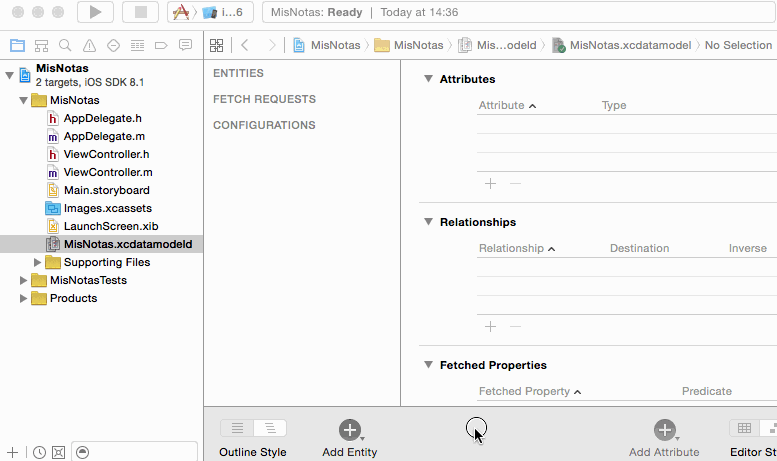

!!! Info Ejercicios
    Esta sección es un ejercicio a seguir paso a paso que vale **0.75 puntos** de la nota del bloque de iOS

## Crear las entidades (0,25 puntos)

Las entidades son los objetos que queremos hacer persistentes en nuestra aplicación. Debemos especificar sus propiedades (nombre y tipo) y como veremos en sesiones posteriores podemos establecer relaciones con otros objetos.

Para gestionar las entidades debemos editar el archivo `xcdatamodeld`. En el editor visual de Xcode podemos, entre otras cosas, añadir entidades. Vamos a crear la única entidad que necesitamos en nuestra aplicación: `Nota`. Para ello seguir estos pasos:

1. **Abrir el modelo de datos**: por defecto Xcode lo crea con el mismo nombre que el proyecto y extensión `xcdatamodeld`. 
2. **Añadir una entidad** pulsando el botón `Add Entity` de la parte inferior. Creará una nueva entidad llamada por defecto `Entity`. Podemos cambiarle el nombre haciendo doble clic sobre él. **Cambiarle el nombre a la entidad** a `Nota` 
4. **Añadir los atributos** pulsando sobre el botón `+` de la sección `Attributes`. Para cada atributo hay que especificar su nombre y tipo. Añadiremos dos atributos, `fecha`, de tipo `Date` y `texto` de tipo `String`

> IMPORTANTE: Los nombres de las entidades deben comenzar por mayúscula y los nombres de los atributos por minúscula. El editor no nos dejará hacer lo contrario.



Selecciona la entidad `Nota` en el editor y selecciona el `Data Model Inspector` en el panel de la derecha de Xcode (el cuarto icono en Xcode 12 , tercer icono en Xcode 11 y anteriores ). En el apartado `Class` verás los datos de la clase Swift que Xcode va a autogenerar para representar a tu entidad. 

Por defecto:

 - El nombre es el mismo que la entidad
 - La clase se crea en el "Global Namespace", lo que quiere decir que no te harán falta `import`s para usarla
 - En el campo `codegen` debería aparecer seleccionado `Class definition`, ese es el método que usa Xcode para generar el código , lo veremos con más detalle en la siguiente sesión.

> Para terminar, asegúrate de guardar el `.xcdatamodel` (`File > Save`). Hay veces que no se genera la clase Swift correspondiente a la entidad si no se hace esto

## Crear datos persistentes (0,5 puntos)

Aquí nos ocuparemos de crear y guardar una nueva nota. Por el momento no se podrán editar ni borrar notas, para simplificar la aplicación, únicamente crear notas nuevas.

### La interfaz de usuario para crear notas

En la (por el momento) única pantalla de la aplicación **añadir los siguientes componentes**:

- Un campo de texto de varias líneas (`text view`) para escribir la nota en sí.
- Una etiqueta (`label`) para mostrar la fecha y hora de la nota 
- Un par de botones, uno para **crear** una nueva nota en blanco y otro para **guardar** la nota actual
- Una etiqueta (`label`) para mostrar mensajes al usuario

Una vez añadidos los componentes, hay que **crear un *outlet* para las dos etiquetas y el campo de texto** y así poder acceder a/cambiar su contenido por código. Recordad que hay que hacer `Ctrl+Arrastrar` desde el componente hasta el archivo donde queremos crear la propiedad (en nuestro caso `ViewController.swift`).

Además hay que **crear un *action* para cada botón**, para poder ejecutar nuestro código cuando se pulsen (con `Ctrl+Arrastrar` igual que antes). Debemos vincular los *action* al evento `Touch up inside`, que es el que aparece por defecto.

### El código que implementa “crear nueva nota”

Debes **implementar el código del *action* del botón de "crear"**.  Este código simplemente limpiará la etiqueta de la fecha, el campo de texto de varias líneas y la etiqueta para mensajes al usuario, asignándoles a las tres la cadena vacía. 


### El código que implementa el guardado

En el código del *action* asociado al botón de “guardar” debemos tomar el valor del campo de texto, crear una nueva nota con  este texto y la fecha y hora actual y hacerla persistente. Además actualizaremos la etiqueta con la fecha y hora actual para que muestre cuándo se ha guardado la nota. Vamos a verlo paso a paso.

Para **crear un nuevo objeto persistente** debemos solicitárselo al contexto, ya que este debe gestionar su ciclo de vida y si lo creáramos nosotros llamando al inicializador el contexto desconocería de su existencia.

Lo primero por tanto es *obtener la referencia al contexto de persistencia*. Como hemos visto en la sección anterior, en la plantilla de Xcode se guarda todo lo de Core Data en el *application delegate*, por lo que vamos a obtenerlo de ahí

En el *action* asociado al botón de "guardar" añade el siguiente código:

```swift
//No te olvides de añadir este import AL PRINCIPIO DEL ARCHIVO      
import CoreData

//obtenemos una referencia al "application delegate" de la aplicación
//En nuestro caso es de la clase AppDelegate
//si esto fallara no tiene sentido continuar, de ahí el guard...else return
guard let miDelegate = UIApplication.shared.delegate as? AppDelegate else {
    return
}
//el acceso al API de core data nos lo da el persistent container
//Lo que más usaremos (con mucho) es el contexto de persistencia
let miContexto = miDelegate.persistentContainer.viewContext
```

> Hay que recalcar de nuevo que el hecho de que el `persistentContainer` esté dentro del  delegate no es propio de Core Data en sí, sino de la plantilla generada por Xcode para inicializar el *stack*.

Para **crear un nuevo objeto** necesitamos relacionarlo con el contexto de persistencia. La clase `Nota` generada por Xcode tendrá un inicializador que acepta como parámetro el contexto:

```swift
let nuevaNota = Nota(context:miContexto)
nuevaNota.fecha = Date()
nuevoNota.texto = "<asignar aquí el contenido del text view>"
```

> Si Xcode da error con el código anterior y no reconoce la clase `Nota` puedes probar a recompilar el proyecto con `Product > Clean Build Folder` y luego `Product > Build`. A veces se genera el código para `Nota` pero no se compila o a veces no se ha generado. También ayuda a veces ir al `.xcdatamodel` y guardarlo: (`File > Save`)

Finalmente **guardamos el objeto en el almacenamiento persistente**. Esto se hace guardando el contexto, que guardará todos los objetos pendientes. El método `save` puede lanzar una excepción que debemos tratar de algún modo, en este ejemplo usamos un `do...catch`

```swift
do {
   try miContexto.save()
} catch {
   print("Error al guardar el contexto: \(error)")
}
```

> El método de utilidad llamado `saveContext` de la plantilla generada por Xcode hace algo muy similar a lo anterior, aunque genera un error fatal que causa la terminación inmediata de la aplicación.
    
Faltaría **actualizar la etiqueta con la fecha y hora de la nota** para que refleje la fecha asignada, y también **actualizar la etiqueta con el mensaje al usuario que indique "nota guardada" o algo similar**. **Escribe el código necesario para hacer esto**.

> Tal y como está ahora el código, cada vez que pulses sobre `Guardar` se creará una **nueva nota**, así que aunque no modifiques el texto si pulsas varias veces tendrás varias notas, que serán iguales en contenido, aunque no con la misma fecha/hora). No es necesario que soluciones esto, déjalo así por el momento.
