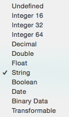

El **modelo de datos** sería más o menos el equivalente al esquema entidad/relación en una base de datos relacional. Con la diferencia de que en Core Data tenemos clases Swift y variables miembro en lugar de tablas y claves ajenas. 

Normalmente en una aplicación hay un solo modelo de datos, que se almacena en un archivo `.xcdatamodeld`. En Xcode, al crear el proyecto con la casilla de "Use Core Data" marcada nos crea un modelo de datos vacío con el mismo nombre del proyecto. Lo más habitual es editar el modelo con el editor gráfico de Xcode, aunque también hay un API Swift para crearlo/manipularlo.

El editor tiene dos modos, el modo "tabla" donde vemos las entidades y atributos como listas de valores, y el modo "gráfico" donde podemos ver un diagrama con las entidades y las relaciones entre ellas. Estos modos se cambian con los dos iconos de la esquina inferior derecha del editor (*Editor Style*). 

## Entidades

Las entidades comparten ciertas características con las clases de la POO y otras con las tablas de una base de datos. Por ejemplo pueden ser *abstractas* y por tanto no directamente instanciables, como las clases de cualquier lenguaje OO.  Por otro lado tienen relaciones con otras entidades (uno-a-uno, uno-a-muchos,...) y se puede especificar qué debe pasar cuando uno de los "lados" de la relación se elimina, como es típico de las bases de datos relacionales.

Si seleccionamos una entidad podemos ver sus propiedades en el "Data Model Inspector", (Cmd+Alt+3 o *clic* en el tercer icono del panel de la derecha de la pantalla)

- `Abstract entity` es análogo a las clases abstractas en POO, indica que la entidad no es directamente instanciable y se usa solo para que otras hereden de ella.
- `Parent entity` indicaría que esta instancia hereda las propiedades de otra
- `Class`: por defecto Xcode creará automáticamente una clase Swift para representar la entidad. Posteriormente veremos dónde está este código y qué estructura tiene.

> En versiones antiguas de Xcode el IDE no generaba por defecto las clases y había que generarlas manualmente. Todavía se puede hacer de este modo si queremos personalizar el código Swift, como veremos posteriormente.

## Atributos de la clase

La característica más destacada de un atributo es el **tipo de datos**. Podemos elegir de entre una serie de tipos, que pueden verse en la siguiente imagen del editor. 

La mayoría son bastante autoexplicativos, salvo los dos últimos. El tipo binario se usa típicamente para imágenes, audio, .... En cuanto a `Transformable` nos permite almacenar cualquier clase Swift/Obj-C. Se parece al binario en el sentido de que en el fondo, los datos se van a almacenar también en binario, pero con `Transformable` proporcionamos un medio de hacer la conversión y a partir de ahí nos "olvidamos" de que el dato se está convirtiendo, si trabajamos con clases propias solo veremos el tipo original.

> Cualquier clase (propia o del sistema) que sea conforme al protocolo `NSCoding` puede usarse como `Transformable` e iOS se encargará automáticamente de convertirla a/desde `NSData`. Veremos más detalles posteriormente.

Además del tipo, las propiedades tienen muchas otras características. Podemos verlas en el "Data Model Inspector", haciendo clic sobre el atributo y luego con el atajo (Cmd+Alt+3) o con *clic* en el tercer icono del panel de la derecha de la pantalla.

Veamos algunas de ellas:

- `Transient` significa que no queremos que la propiedad sea persistente. Es típico de los valores que son calculados a partir de otros y que podemos volver a calcular fácilmente (por ejemplo el total de un pedido). Aun no siendo persistentes, estas propiedades también pueden participar en operaciones de “deshacer y rehacer” (*undo & redo*)
- `Optional` es el contrario del típico "not null" de las bases de datos. Si un campo es opcional, puede ser `nil`. 
- `Indexed` también es el mismo concepto que en BD. Un atributo indexado estará optimizado para las búsquedas que hagamos sobre él pero ocupará más espacio de almacenamiento.
- Reglas de validación: valor mínimo y máximo (si es numérico), longitud mínima y máxima (si es cadena), `Reg Exp`, la expresión regular con la que deben encajar los valores del atributo.
- Valor por defecto (`default`) que se asignará automáticamente si no le damos un valor explícito.

## Fetch requests

En el editor podemos crear *fetch requests* predefinidas. Estas *requests* son lo que en una base de datos llamaríamos *consultas* o *queries*. 

Mantenemos pulsado el botón de `Add Entity` para que aparezca un menú contextual y en él elegimos la opción `Add fetch request`. Podemos añadir gráficamente las condiciones deseadas. Veremos la sintaxis de las condiciones cuando tratemos las consultas en Core Data.

## Relaciones

Las relaciones en Core Data son muy similares al concepto equivalente en BD relacionales: vinculan una entidad con otra u otras, generalmente de otro tipo.

Cuando creamos una relación usando el estilo de "tabla" en el editor visual, las tres características directamente editables son:

- **Nombre**: es arbitrario y la única condición es que debe comenzar por minúscula, al igual que las propiedades. No obstante, una práctica común es ponerle el mismo nombre que la entidad a la que vincula pero en minúscula. Por ejemplo si tenemos un `Mensaje` y queremos establecer una relación con el `Usuario` que lo ha enviado llamaríamos a la relación simplemente `usuario`. Si es una relación uno a muchos se suele usar el plural. Así, si tenemos un ``Usuario` y queremos vincularlo con todos sus mensajes llamaríamos `mensajes` a la relación.
- **Destino**: la entidad vinculada
- **Inversa**: Se recomienda que todo vínculo entre entidades tenga su relación inversa, que es la que nos permite "volver al punto de partida". En el ejemplo de mensajes/usuarios, la inversa de la relación `usuario` sería `mensajes`.

> Las relaciones que no tienen inversa generan *warnings* en Xcode, ya que Core Data usa la bidireccionalidad para poder mantener la consistencia del grafo de objetos cuando se eliminan entidades.

Al igual que con las entidades y las propiedades, podemos cambiar los atributos de una relación seleccionándola y yendo al “Data Model Inspector”, (recuerda, Cmd+Alt+3 o *clic* en el tercer icono del panel de la derecha de la pantalla).

- `Transient` y `optional` son equivalentes a los atributos del mismo nombre usados en las propiedades.
- `Delete rule` es la típica regla a aplicar cuando se borra la entidad “fuente” de la relación: por ejemplo con `cascade` si se borra la entidad, las relacionadas también lo hacen automáticamente, con `deny` no se puede borrar la entidad si hay relacionadas, con `nullify` la relación inversa se pone a `nil` y con `no action` la relación inversa queda tal cual (aunque apuntará a un objeto que ya no existe (!))
- con `Type` podemos indicar si es una relación uno a uno o uno a muchos. Las relaciones muchos a muchos las conseguimos poniendo tanto la relación como la inversa con el tipo “a muchos”.

En el editor de *data models* de Xcode, si nos ponemos en modo `Graph` podemos ver gráficamente las relaciones entre objetos y crearlas con ctrl-click en la entidad "origen" y arrastrando hasta la entidad destino. Las relaciones "uno a uno" aparecen con una única punta de flecha en el destino, y las "uno a muchos" con dos.

En el caso de relaciones “a muchos” podemos especificar: 

- Si queremos que sean ordenadas (`ordered`). Por ejemplo nos dará lo mismo el orden para un `Género` musical que tiene asociados muchos `Disco`s, pero no es indiferente en el caso de una `Conversacion` y los `Mensaje`s que la componen.
- La cardinalidad mínima y máxima (podemos fijar un límite numérico o dejarlo vacía (*unbounded*)

## Fetched properties

Son similares a las relaciones, pero no son bidireccionales. Cada *fetched property* está basada en una consulta (*fetch request*). Por ejemplo podríamos tener una propiedad `mensajes_recientes` que nos devolviera los mensajes que ha enviado recientemente un usuario.

Para crear una *fetched property* mantenemos pulsado el botón de `Add attribute` hasta que aparezca el menú contextual, donde seleccionamos `Add fetched property`. Tenemos que especificar su nombre y el *predicado* (la condición de la “consulta asociada”). Veremos algún ejemplo cuando hablemos de consultas en Core Data. 

> Cuidado, las *fetched properties* no son dinámicas, sino *lazy*, su valor no se recalcula automáticamente cada vez que accedemos a ellas, hay que recalcularlas explícitamente con `refreshObject:mergeChanges:`.

