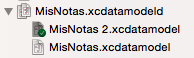
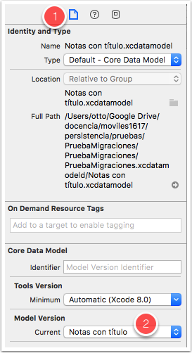

Siendo la evolución progresiva del modelo de datos algo tan común en cualquier desarrollo de aplicación iOS es lógico que Core Data tenga algún mecanismo de *control de versiones*, para que sea accesible el historial de los sucesivos cambios. No estamos hablando del control de versiones general del proyecto, (`git` o el que sea que usemos), ya que con el "tradicional" Core Data no tiene acceso más que a la última versión del modelo.

Hasta ahora cuando hemos hecho cualquier modificación del modelo en nuestros proyectos simplemente la hemos hecho sin más y en su caso hemos guardado los cambios con `Cmd-S`. Pero esta no es la forma más adecuada de hacerlo. Lo que debemos hacer es especificar que queremos *crear una nueva versión* del modelo.

!!! Warning "Migraciones sin versionado"
    En realidad, hasta el momento la estrategia de ir modificando el modelo de datos "sobre la marcha" nos ha funcionado porque el *stack* de Core Data que crea la plantilla por defecto de Xcode usa la clase `NSPersistentContainer` que al arrancar la *app* verifica que el modelo de datos sea el mismo que el usado para crear la BD actual, y si no lo es, efectúa automáticamente la migración. 
    Si estuviéramos usando una inicialización del *stack* de Core Data propia que no usara `NSPersistentContainer` es posible que al cambiar el modelo y arrancar la *app* nos encontráramos con un error que dice `"The model used to open the store is incompatible with the one used to create the store"`. Para resolverlo tendríamos que cambiar a `NSPersistentContainer` o bien borrar manualmente la base de datos para forzar a Core Data a crearla de cero (en este caso perderíamos todos los datos).

En cualquier momento dado podemos crear una nueva versión del modelo de datos y tener varias almacenadas en nuestro proyecto (varios archivos `xcdatamodeld`) aunque en cada momento solo una de ellas se tomará como la “actual”.

Para crear una nueva versión, seleccionar el `.xcdatamodeld` y en el menú de Xcode elegir `Editor > Add Model Version`. Aparecerá un cuadro de diálogo que nos pedirá el nombre para la nueva versión y qué versión actual toma como base. A partir de este momento podremos ver en el árbol de ficheros del proyecto una especie de *subárbol* con todas las versiones del `.xcdatamodeld`. La versión actual o activa en este momento aparece con una pequeña marca verde de verificación.

 

Para cambiar de versión activa, en el panel de la derecha, pulsar sobre el primer icono (`Identity and type`), y en la parte inferior del panel elegir la versión en el desplegable `Model Version`.

