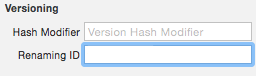
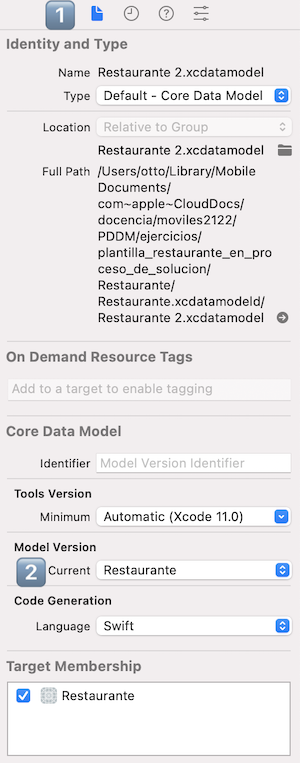

# Ejercicio de migraciones de datos (0,5 puntos)

Vamos a hacer un par de modificaciones sobre el modelo de datos de (¡cómo no!) la aplicación de notas

- Ve al modelo de datos y crea una nueva versión con `Editor > Add model version...`. Ponle el nombre que quieras.
- Edita esta nueva versión y en ella cambia de nombre el campo “texto” por “contenido”. 
- Tendrás que indicar que esto es un cambio de nombre y no un campo nuevo. Selecciona el atributo y en sus propiedades en el panel de la derecha pon el nombre antiguo como `renaming ID`. 

- Fija la nueva versión del modelo como la versión actual: 
	+ Estando editando el `xcdatamodeld`, selecciona el `File Inspector` en el panel de la derecha (primero de los iconos, 1️⃣ en la siguiente figura)
	+ Al final del panel de la derecha cambia la versión del modelo de datos a la nueva que has creado, en el desplegable de la sección `Model Version` (2️⃣ en la figura)

- Tendrás que modificar también el código fuente. Donde salga alguna referencia a la propiedad `texto` de la entidad `Nota`:
	1.  Selecciona la propiedad
	2.  Pulsa botón derecho del ratón
	3.  En el menú flotante, selecciona `Refactor > Rename...`
	4.  Xcode debería detectar y mostrar todas las referencias a la misma propiedad en el archivo que estás editando y en el resto de archivos. Si pulsas sobre el botón azul `Rename` se hará el cambio en todos ellos.

Ejecuta la aplicación y comprueba que todo sigue funcionando. Si accedes a la carpeta con la base de datos podrás comprobar que en la tabla `ZNOTA` se ha cambiado la columna `texto` por `contenido`