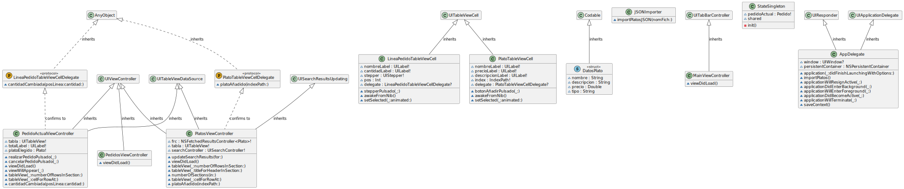

# Miniproyecto: *app* restaurante (2,5 puntos en total)

El objetivo es desarrollar una pequeña aplicación para gestionar pedidos *online* a un restaurante. Para ello almacenaremos los datos de la carta y de los pedidos realizados por el usuario en Core Data.

Descárgate la plantilla de la aplicación desde moodle, aquí está ya implementada la mayor parte de la interfaz.

Inicialmente nos ocuparemos del modelo de datos y de leer los datos de los platos, que están almacenados en un JSON, y pasarlos a Core Data. Una vez hecho esto nos pondremos a implementar las funcionalidades de la aplicación.

## El modelo de datos (0,5 puntos)

**En el proyecto abre el fichero `Restaurante.xcdatamodeld` y crea el siguiente modelo de datos**

Nuestro modelo de datos debe tener tres entidades, `Plato`, `Pedido` y `LineaPedido`. Esta última es la que relaciona los platos con los pedidos,  guardando cuántas unidades de un plato se han incluido en un pedido. 

> En la figura, las flechas dobles representan relaciones "a muchos" y las flechas simples "a uno"


!!! info "Consejos"
    - Crea primero todas las entidades y después las relaciones, si no no podrás especificar la entidad destino de cada relación
    - Las relaciones por defecto se crean "*de uno a uno*" y sin orden, recuerda modificar esto en el panel derecho de Xcode si es necesario

Cada entidad debe tener las siguientes propiedades y relaciones

- `Plato`:
    + Propiedades:
        * `nombre` de tipo `String`
        * `descripcion` de tipo `String`
        * `precio` de tipo `Double`
        * `tipo` de tipo `String`
    + Relaciones:
        * `lineasPedido`, relación "a muchos" con destino `LineaPedido`. La inversa es la relación `plato`
- `Pedido`:
    + Propiedades:
        *  `direccion` de tipo `String`
        *  `fecha` de tipo `Date`
        *  `telefono` de tipo `String`
    +  Relaciones:
        *  `lineasPedido`, relación "a muchos" con destino `LineaPedido`. La relación **debe ser ordenada**, para poder mostrar las lineas de un pedido siempre en el mismo orden. La inversa es la relación `pedido`. En la regla de borrado (`delete rule`) pon `Cascade` para que al eliminar un pedido se eliminen automáticamente sus líneas.
-  `LineaPedido`:
    +  Propiedades
        *  `cantidad` de tipo `Integer 16`
    +  Relaciones
        *  `pedido`, relación "a uno" con destino `Pedido`. La inversa es la relación `lineasPedido`
        *  `plato`, relación "a uno" con destino `Plato`. La inversa es la relación `lineasPedido`

!!! info "Simplificaciones"
    Deberíamos usar tipos `Decimal` en los precios para evitar errores de redondeo, pero usaremos `Double` por simplicidad, ya que `Decimal` no se acepta directamente en Core Data y tendríamos que usar un *transformable*. Además, el tipo del plato debería ser un enumerado, pero estos tampoco se pueden almacenar directamente en Core Data.

## Inicializar los datos (0,25 puntos)

Un problema habitual en Core Data es cómo rellenar inicialmente la base de datos. Un enfoque muy habitual es incluir en el proyecto un archivo con los datos en algún formato estándar (JSON, CSV, YAML,..) y copiarlos a Core Data la primera vez que se ejeuta la app. Es lo que haremos aquí.

Los datos de los platos del restaurante están en un archivo `platos.json`.  En el `AppDelegate` hay una función `importPlatos` que lee el JSON, lo almacena en un array de `structs` de tipo `DatosPlato` con los datos correspondientes, y pone una preferencia de usuario llamada `platosImportados` a `true`. El JSON solo se lee si la preferencia está a `false` (valor por defecto)

**Añade código Swift que copie los datos de los structs `DatosPlato` a entidades `Plato` y guarde el contexto de persistencia para hacer efectivos los cambios**. Tendrás que introducir el código en el `AppDelegate`, línea 34, donde está el comentario de `//TODO: copiar los datos`. El array de structs de tipo `DatosPlato` se llama `datos`. Recórrelo y copia todos sus datos a Core Data. Las propiedades de `DatosPlato` tienen los mismos nombres y tipos que en la entidad `Plato`.

Tras esto, con la ayuda de la aplicación [`SimSim`](https://github.com/dsmelov/simsim/blob/master/Release/SimSim_latest.zip?raw=true) puedes echarle un vistazo a la base de datos de SQLite creada por Core Data para ver si están los registros. En `SimSim` selecciona la app `Restaurante` y luego la opción `Terminal` para abrir una terminal en la carpeta de la *app* en el emulador. Para ver a base de datos SQLite puedes hacer en esta terminal:

```bash
cd "Library/Application Support"
sqlite3 Restaurante.sqlite
##Debería aparecer el prompt de sqlite -> "sqlite>"
##Con esta orden puedes ver la estructura de la BD
.schema
##Las tablas tendrán el mismo nombre que las entidades de Core Data con una "Z" delante
##Por tanto puedes ver los platos con
select * from ZPLATO;
##Puedes salir de sqlite con Ctrl-Z, o cerrar la terminal, ya no te hace falta 
```

Para forzar la recarga de los datos puedes usar también la aplicación `SimSim` . Tendrás que borrar las preferencias y la base de datos. Puedes borrarlo todo automáticamente con la opción `Reset Application Data`. Si quieres borrarlo a mano, las preferencias están en `Library/Preferences` y recuerda que la BD está en `Library/Application Support`.


A partir de ahora implementaremos las funcionalidades de la *app*. La mayor parte de la interfaz ya está creada (salvo la última pantalla), tú tienes que implementar las funcionalidades relacionadas con Core Data.

## Funcionalidad: La Carta (0,5 puntos)

Esta parte de la *app* es la que muestra los platos y nos permite añadirlos al pedido.

En la pantalla de "Carta" se deben mostrar los datos de los platos. Está controlada por el `PlatosViewController`. Iremos primero con que salgan los platos listados y luego con la funcionalidad del botón de "Añadir" al pedido.

### Listado de platos

Usa un `NSFetchedResultsController` para **listar los platos** en la tabla. Haz que los platos se agrupen en secciones según su tipo.

+ Declara e inicializa el `NSFetchedResultsController` en el `PlatosViewController`.  Es como los de la sesión anterior con la diferencia de que no debería usar una cache (pasar el parámetro `cacheName` a `nil`) , ya que al escribir en la barra de búsqueda cambiamos la *fetch request* y por tanto invalidamos la cache, por lo que en este caso no tiene utilidad.

!!! info "Ayuda"
    Para lo anterior, puedes usar como guía el código de ejemplo del apartado *["inicializar el Fetched Results Controller"](../../cap7/2_configuracion_basica/)*. Pero con diferencias, algunas evidentes:

    + Recuerda poner el nombre de cache a `nil` 
    + La entidad es `Plato` en lugar de `Mensaje`
    + Hay que ordenar por "tipo" en vez de por "fecha"
    + Hay que crear secciones automáticas basándose en el tipo (mira el apartado [*"secciones de tabla automáticas "*](../../cap7/5_secciones/))

+ Rellena el código de los métodos que devuelven el número de secciones, de filas en cada sección y que devuelven las celdas rellenadas de la tabla. Estas celdas son de la clase `PlatoTableViewCell`, si miras la clase verás que ya tiene definidos *outlets* para poder rellenar los datos (son tres *labels*: `nombreLabel`, `descripcionLabel` y `precioLabel`)

!!! info "Ayuda"
    Para lo anterior, puedes usar como guía el código de ejemplo del apartado *["Mostrar los datos en la tabla"](../../cap7/3_tabla/)*. Para saber cómo obtener el título de cada sección de la tabla consulta el apartado ["Secciones de tabla automáticas"](../../cap7/5_secciones/) 

Al terminar este apartado debería salir la lista de platos de la carta en la primera pantalla de la app. Todavía no funcionará el botón "Añadir" de cada plato ni se podrán filtrar platos.

### Búsqueda/Filtrado de platos

Implementa una **búsqueda/filtrado de platos** como hiciste en la aplicación de notas, que busque texto en el nombre o en la descripción del plato. Para aplicar el "filtro":

Declara un `UISearchController` en el `PlatosViewController` 

```swift
var searchController : UISearchController!
```

e inicialízalo en el `viewDidLoad`

```swift
self.searchController = UISearchController(searchResultsController: nil)
```

Añade `UISearchResultsUpdating ` a la cabecera del controller para que se ocupe de los resultados de la búsqueda, debe quedar como:

```swift
class PlatosViewController: UIViewController, UITableViewDataSource, PlatoTableViewCellDelegate, UISearchResultsUpdating  {
    ...
}
```

!!! warning "Xcode"
    Al añadir el `UISearchResultsUpdating` Xcode se "quejará"" de que falta implementar el método `updateSearchResults`. Lo haremos en un momento. 

Configura el *search controller* y añádelo a la tabla en el `viewDidLoad`
```swift
self.searchController.searchResultsUpdater = self
//Configuramos el search controller
self.searchController.obscuresBackgroundDuringPresentation = false
self.searchController.searchBar.placeholder = "Buscar texto"
//Lo añadimos a la tabla
self.searchController.searchBar.sizeToFit()
self.tabla.tableHeaderView = searchController.searchBar
```

Opcionalmente puedes usar un [Throttler](Throttler.swift) para que no busque en cada pulsación de tecla, sino que espere una fracción de segundo. En caso de que quieras usarlo, bájate el código del enlace anterior, ponlo en un archivo en tu proyecto y define en el *controller* una variable de la clase `Throttler`:

```swift
let throttler = Throttler(minimumDelay: 0.5)
```

Añade el método `updateSearchResults` al `PlatosViewController`, **aquí es donde realmente tienes que implementar el filtrado (en un momento veremos cómo)**

```swift
func updateSearchResults(for searchController: UISearchController) {
    //este throttler.throttle solo si quieres usar throttling
    //en caso contrario solo el let textoBuscado=... etc
    throttler.throttle {
        let textoBuscado = searchController.searchBar.text!
        //Aquí iría tu código de búsqueda
    }
}
```

!!! warning "Borrar la cache"
    Ya hemos comentado que el `NSFetchedResultsController` no necesita cache, pero si la tuviera, en este momento se debería borrar con el método `NSFetchedResultsController.deleteCache(withName:)` para evitar un error al cambiar la *fetch request*.

**Crea un predicado (`NSPredicate`) con la condición de búsqueda apropiada** para buscar el `textoBuscado` en el nombre o la descripción (no debe distinguir mayúsculas/minúsculas ni acentos) y **asígnaselo a la propiedad `fetchRequest.predicate`** del `NSFetchedResultsController`. 


!!! info "Ayuda"
    Para lo anterior, puedes usar como guía el apartado *["Predicados como cadenas"](../../cap6/1_predicados/#predicados-como-cadenas/)* del tema de búsquedas en Core Data.

Para que se actualicen los datos tendrás que hacer:

```swift
try! self.frc.performFetch()
self.tabla.reloadData()
```
Tras hacer esto ya debería funcionar el filtrado de platos, compruébalo.

!!! warning "Problema con las búsquedas"
    Si pruebas la búsqueda verás que con el cuadro de búsqueda inicialmente vacío se muestran todos los platos, cuando escribes algo se filtran pero **cuando vuelves a borrar y lo dejas vacío no se ve ningún plato**. Esto es porque aunque `textoBuscado`sea vacío sigue actuando el predicado de búsqueda. ¿Se te ocurre cómo podrías arreglarlo? Inténtalo.

### Añadir al pedido actual

Las celdas de la tabla tienen un *delegate* al que  avisarán de que se ha pulsado el botón "Añadir". Cada celda almacena su `IndexPath` (su número de fila y de sección) y tiene como *delegate* al *controller* de la pantalla.

Para avisar al *controller* de que se ha pulsado sobre "Añadir" se llama al **método `platoAñadido`. En este método tienes que obtener la entidad `Plato` elegida (la que está en la fila y sección seleccionadas)** para que el código restante (ya implementado) se lo pase al controller de la pantalla siguiente.

!!! warning Líneas por descomentar
    Tendrás que descomentar además la línea que pone `//TODO: descomentar esta línea` del `PlatosViewController` y la 21 del `PedidoActualViewController`. Estaban comentadas para que el código compilara en el estado inicial del proyecto, antes de que existiera la entidad "Plato"

Para probar que está bien, en el `viewDidLoad` del `PedidoActualViewController` imprime en la consola con `print` algún dato de la propiedad `platoElegido`, para comprobar que se corresponde con el seleccionado. De momento el plato no aparece todavía en la pantalla del móvil, de eso nos ocuparemos en el siguiente apartado.

## Funcionalidad: El pedido actual (0,75 puntos)

Esta parte de la *app* muestra los datos del pedido actual, añade los platos seleccionados al pedido y permite hacer el pedido o cancelarlo. La pantalla está controlada por el `PedidoActualViewController`.

!!! warning "Problemas con el Tab bar"
    A esta pantalla se puede llegar de dos modos, al añadir un plato al pedido o bien con el botón "Tu pedido" del *tab bar* en la parte inferior de la pantalla. Mientras estés implementando esta pantalla es probable que el botón del *tab bar* cause un error fatal, al final veremos por qué y lo intentaremos arreglar.


El pedido actual no se puede guardar en el propio *controller* ya que por la navegación entre pantallas este se destruiría al salir de ella. Por eso se debe guardar aparte, en la variable `pedidoActual` del *singleton* `StateSingleton.shared`. **Esta variable estaba comentada para que no diera error**  ya que hasta que no creaste el modelo de datos no existía la entidad `Pedido`, **descoméntala** (línea 5 de carpeta State/Archivo StateSingleton.swift). 

### Añadir el plato elegido al pedido

En el `viewDidLoad` de `PedidoActualViewController` nos tenemos que ocupar de añadir el plato elegido al pedido actual

- Primero **comprueba si no hay en memoria un `Pedido` actual (`StateSingleton.shared.pedidoActual==nil`), y si es así créalo en Core Data, guárdalo en el `StateSingleton` y haz save() del contexto de persistencia**
- **Crea una nueva `LineaPedido`**
    - Asígnale cantidad 1 (luego se podrá cambiar con los botones de `+/-`)
    - Asóciala con el plato elegido. Recuerda que el plato elegido debería estar en la propiedad `platoElegido` del controller.
    - Asóciala con el pedido

!!! info "Asociar entidades en Core Data"
    Recuerda que las relaciones en Core Data son como propiedades de los objetos. Por ejemplo para asociar una línea de pedido con un plato harías simplemente
    ```swift
    //Suponiendo que "linea" es de tipo LineaPedido y "elPlato" de tipo "Plato"
    linea.plato = elPlato
    ```
    Si la relación es "a muchos" tendrías que usar un método de los generados por xCode que empiezan por `addTo...`. El ejemplo anterior lo podrías hacer también como

    ```swift
    elPlato.addToLineasPedido(linea)
    ```

    Aunque es mucho menos intuitivo

- **Guarda el contexto de persistencia** con `save()` para que los cambios tengan efecto en la BD.
    
### Listar los platos del pedido

Como puedes ver en el código del `PedidoActualViewController` éste hace de `UITableViewDataSource`, es decir es el responsable de darle a iOS los datos para pintar la tabla que muestre el pedido actual.

**Tendrás que completar el código de los métodos**

- `tableView(_ tableView: UITableView, numberOfRowsInSection section: Int)`
-  `tableView(_ tableView: UITableView, cellForRowAt indexPath: IndexPath)` 

para que la tabla se vea en pantalla. La celda es de la clase `LineaPedidoTableViewCell` y como podrás ver en ella tiene un `nombreLabel` y un `cantidadLabel` que son los datos que tendrás que rellenar con el nombre del plato y la cantidad de la línea de pedido respectivamente.

### Cambiar la cantidad de un plato

En esta pantalla también se puede cambiar el número de unidades que queremos pedir de un plato. 

> Para simplificar se supondrá que solo podemos movernos entre 1 y 100, no podemos bajar las unidades a 0 y eliminar el plato

Al igual que en la pantalla anterior se usa la idea de *delegate* para saber qué celda se está seleccionando. Las celdas son de la clase `LineaPedidoTableviewCell`, y cada vez que se pulsa en un `+` o un `-` se avisa al *delegate* (en este caso el controller), pasándole el número de la fila.

La interfaz ya está configurada para que el método `cantidadCambiada` del controller se llame cada vez que el usuario cambia la cantidad de un plato. **Añádele código que obtenga la línea de pedido correspondiente, cambie la cantidad y guarde el contexto de persistencia**

### Realizar y cancelar pedido

En la pantalla tienes dos botones para realizar y cancelar el pedido. 

- Si se pulsa a "realizar" bastará con que le asignes la fecha actual al pedido, crees un nuevo pedido en `StateSingleton.shared.pedidoActual` y muestres un mensaje al usuario indicando que "su pedido está en camino" o algo similar
- Si se pulsa a "cancelar" deberías borrar en Core Data el pedido actual. Si la regla de borrado en cascada está puesta correctamente, al borrar un pedido deberían borrarse 
automáticamente todas sus líneas.

### El botón "Tu pedido" del *tab bar*

Como ya hemos comentado, a la pantalla de pedido actual también se puede llegar pulsando el botón de "Tu pedido" en el *tab bar* inferior. No obstante, como al ir por este camino no hay un `platoElegido` es bastante probable que tu código falle al asumir que sí lo hay. Si falla, cambia el código para que si  hay `platoElegido` (`!=nil`)  cree la nueva línea de pedido pero no lo haga si es `nil`.

## Funcionalidad: Tu historial (hasta 0,5 puntos)

En esta pantalla se deberían mostrar todos los pedidos realizados por el usuario actual. La pantalla está controlada por el (`PedidosViewController`). Está en blanco y puedes crear la interfaz del modo que desees.

- (0,25 puntos) Si en el `viewWillAppear` muestras los datos de todos los pedidos en la consola con `print`, solo para ver que efectivamente se han almacenado correctamente
- (0,5 puntos) Si en lugar de lo anterior muestras en una tabla una línea con el resumen de cada pedido (fecha, total y número de platos pedidos)


## Apéndice: diagrama UML de las clases del proyecto


   