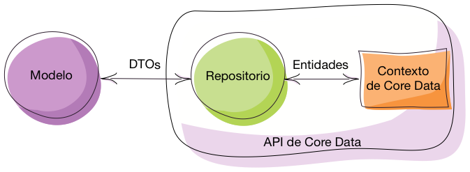

# Arquitecturas de aplicaciones iOS. **Parte I: MVC**
## Persistencia en dispositivos móviles


---

## Puntos a tratar

- Los problemas de MVC
- Refactorizando un *view controller*

---

## Puntos a tratar

- **Los problemas de MVC**
- Refactorizando un *view controller*


---

## MVC en la teoría


---

## MVC en la práctica


<div class="stretch">
</div>

---

Ejemplo de aplicación en la que "todo lo hace el view controller"

- [Fuente de la *app* en Github](https://github.com/ottocol/mvc-refactor-swift/) (versión actual ya refactorizado)
- [Código del *view controller*](https://github.com/ottocol/mvc-refactor-swift/blob/v1.0/ListaCompra/ListaViewController.swift)

---

## ¿Qué funciones está haciendo aquí el controller?


---

## Vamos a refactorizar el *view controller* para que no realice tantas tareas distintas


---

<!-- .slide: data-background-image="https://www.mycustomer.com/sites/default/files/styles/banner/public/warning_0_0_0_0_1_0_0.jpg" -->

<span style="color:white; font-weight:bolder; font-size: 2em">A partir de aquí, todo es opinable</span>

---

## Fuentes

- Principios básicos de programación
- Patrones de diseño
- "Sentido común"

---


## **Principio de Responsabilidad Única**: una clase debería tener solo una razón para cambiar

Nuestro *view controller* debe cambiar si cambia:

- La agrupación de las tareas en categorías
- El almacenamiento (p.ej. guardarlo como JSON, o como preferencias)
- La representación de los datos en la tabla
- ...

Otro principio similar: separación de intereses (*separation of concerns*)

---

## Cambios a realizar

* Encapsular la lógica en un **modelo** 
*  Encapsular la persistencia en un **repositorio** (también llamado DAO, *data mapper*, ...)
    * Además de separar responsabilidades, facilita el cambio en el mecanismo de persistencia (¿preferencias?, ¿SQLite?)
* Separar la responsabilidad de actuar como **datasource**
* Extraer el código que **configura las celdas**


---

## Encapsular la persistencia en una *app* con Core Data

Es más complicado, ya que Core Data mezcla **modelo** (entidades) y **persistencia**

```swift
let u = Usuario(context:miContexto)
```


No es un problema tan grande, porque...

<ul>
<li class="fragment">El API de persistencia es suficientemente sencillo como para "no molestar"</li>
<li class="fragment">En una *app* con Core Data raramente cambiaremos de API de persistencia</li>
</ul>

---

### No obstante, si nos empeñáramos...



Los **Data Transfer Objects** (DTOs) son copias de las entidades, pero sin estar vinculados a ningún contexto de persistencia ([patrón de diseño](https://martinfowler.com/eaaCatalog/dataTransferObject.html) típico de *apps enterprise*)

Así, tendríamos una clase `UsuarioVO` y una clase `Usuario` que sería la entidad de Core Data. Nuestro código trabajaría solo con la primera, la segunda la vería solo el repositorio

---


Para más detalles, podéis ver la charla: "*Refactoring tne Mega Controller*", de Andy Matuschak (**¡Muy recomendable!**)

- [Video de la charla](https://vimeo.com/140037432)
- [Código de ejemplo en Github](https://github.com/andymatuschak/refactor-the-mega-controller)


---

# ¿Alguna pregunta?