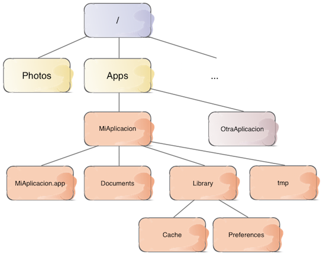

# Sesión 1. Persistencia básica
## Persistencia en Dispositivos Móviles (iOS)

---

## Persistencia de datos en iOS

- **Persistencia básica** (poca cantidad de datos, no ofrece mecanismos de búsqueda y organización sofisticados)
  + Property Lists
  + Preferencias de usuario
  + Serialización de objetos

---

## Persistencia de datos en iOS (2)

- **"Bases de datos"** (mayor cantidad de datos, mecanismos de búsqueda)
  + SQLite
  + Core Data
  + APIs propios (iCloud), APIs de terceros (en "la nube") 

---

## Persistencia de datos en iOS (y 3)

- **"Objetos persistentes"** del sistema, accesibles desde las aplicaciones
  + Documentos
  + Calendario
  + Contactos
  

---

## Puntos a tratar hoy

- El sistema de archivos en iOS
- Serialización
- *Property Lists*
- Preferencias del usuario


---

## Puntos a tratar hoy

- **El sistema de archivos en iOS**
- Serialización
- *Property Lists*
- Preferencias del usuario

---


## *Sandboxing*

Cada aplicación está contenida en un **sandbox** de modo que únicamente ella puede acceder a sus propios datos. Esto incluye los archivos y directorios de la aplicación


---

## El sistema de archivos de iOS



---

## Paths vs URLS

En el API podemos usar *paths* o *URLs* para localizar un archivo o directorio

- Normalmente en los métodos que usan *path* su nombre acaba en `Path` y el método equivalente con URLs se llama igual pero acabado en `URL` 
- La documentación recomienda URLs por uniformidad 


```swift
//¿Dónde está el "bundle" de la aplicación?
let bundleDir : String = Bundle.main.bundlePath
let bundleURL : URL = Bundle.main.bundleURL
```

---

## Acceso al *sandbox*

- El `FileManager` es el encargado del acceso al *sandbox*. No hace falta crearlo, `FileManager.default` es el *manager* por defecto
- Acceso a directorios: método `urls(for:in:)`, del `FileManager`
    + `for`: cte. que especifica directorio (`.documentDirectory`, `.cachesDirectory`, ...)

```swift
let urls = FileManager.default.urls(for:.documentDirectory, in:.userDomainMask)
//Nótese que el método devuelve un array de URLs
//Casi siempre nos interesa solo la primera
if(urls.count>0) {
    let docDir = urls[0]
    print("El directorio 'Documents' es \(docDir)")
}
else {
    print("error al buscar el directorio 'Documents'")
}
```

---

## ¿Dónde está físicamente el *sandbox*?

- El simulador mapea el *sandbox* con un directorio físico del Mac
- Útil acceder para comprobar si nuestra *app* crea bien los datos
- Por desgracia, la URL local del *sandbox* depende de un id de aplicación que Xcode genera dinámicamente y es difícil identificar

---


